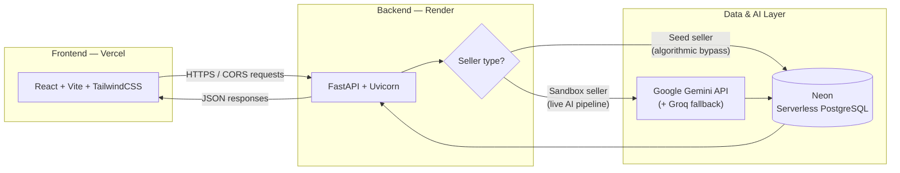
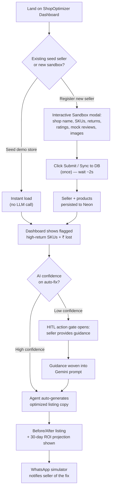

# Amplify AI Coach

**An autonomous AI co-pilot for e-commerce sellers — detecting high-return SKUs, diagnosing customer friction, and deploying AI-optimized listings to recover lost revenue.**

Built for the Meesho ecosystem. Full-stack, serverless, and AI-driven end to end.

---

## Table of Contents

- [Overview](#overview)
- [Problem Statement](#problem-statement)
- [Core Features](#core-features)
- [System Architecture](#system-architecture)
- [Tech Stack](#tech-stack)
- [Project Structure](#project-structure)
- [Local Setup Instructions](#local-setup-instructions)
- [Environment Variables](#environment-variables)
- [API Reference](#api-reference)
- [Database Schema Notes](#database-schema-notes)
- [Known Behavior: Cold Starts & Free-Tier Hosting](#known-behavior-cold-starts--free-tier-hosting)
- [Engineering Decisions](#engineering-decisions)
- [Challenges We Ran Into](#challenges-we-ran-into)
- [Future Roadmap](#future-roadmap)

---

## Overview

Amplify is an intelligent, autonomous storefront manager built for e-commerce marketplace sellers. It continuously scans a seller's inventory for high-friction, high-return SKUs, analyzes unstructured customer feedback, and automatically deploys optimized product descriptions to reset buyer expectations, reduce return velocity, and recover lost GMV (Gross Merchandise Value).

Rather than surfacing raw model output, Amplify translates AI reasoning into a business-first workflow: sellers see revenue impact in rupees, get a clear before/after view of every listing change, and retain the ability to guide the AI when its confidence is low.

## Problem Statement

High return rates on marketplace platforms are frequently caused by a mismatch between what a listing promises and what a customer receives - vague sizing, missing fabric details, unclear fit, or overstated claims. Sellers rarely have the bandwidth to manually audit thousands of SKUs against return reasons and review sentiment. Amplify automates this audit-and-fix loop, while keeping a human in control for edge cases.

## Core Features

### ShopOptimizer Dashboard
The primary operational surface for a seller. Converts raw agent diagnostics into business-readable metrics — most notably, monthly revenue lost to returns, expressed in rupees rather than abstract percentages.

### Interactive Sandbox (Demo / Evaluation Mode)
A self-serve registration modal that lets any evaluator spin up a fully isolated "Seed Demo Store." Users can:
- Register a custom shop name
- Add custom products with simulated return rates and ratings
- Paste mock customer complaints / reviews
- Upload local product images (encoded as Base64 for direct, serverless-friendly database storage)

### Human-in-the-Loop (HITL) Pipeline
When the agent flags a product but has low confidence in an autonomous fix, it pauses deployment and opens an action gate. The seller can supply explicit guidance (for example, *"Specify that the fabric is lightweight for summer"*), which is dynamically woven into the final AI-generated listing copy before it is applied.

### Live ROI Projection
A before/after comparison of the product description alongside a projected 30-day drop in return rate and recovered revenue, so the impact of every AI edit is immediately visible.

### WhatsApp Notification Simulator
A floating UI overlay that mimics real-time mobile push notifications, alerting the seller whenever the agent applies an autonomous fix or requires HITL sign-off, demonstrating how this would integrate into a real seller's day-to-day workflow.

## System Architecture



**Request flow for a listing fix:**
1. Frontend identifies a flagged SKU on the ShopOptimizer Dashboard.
2. Backend checks whether the seller is a static "seed" demo account or a live sandbox account.
   - **Seed sellers** are routed through an algorithmic bypass — no LLM call, instant response, zero API cost.
   - **Sandbox sellers** are routed to the live Gemini pipeline.
3. If the AI's confidence is below threshold, the HITL gate is triggered and the request pauses for seller input.
4. On confirmation, the backend persists the updated listing to Neon and returns the before/after payload to the frontend.

## Application Flow (Judge / Evaluator Journey)

This diagram walks through the full user journey an evaluator will experience, from landing on the app to seeing a recovered-revenue projection.



## Tech Stack

| Layer | Technology |
|---|---|
| Frontend framework | React.js (bootstrapped with Vite) |
| Styling | Tailwind CSS |
| Backend framework | Python — FastAPI, served via Uvicorn |
| AI / NLP | Google Gemini API (primary), Groq (secondary) |
| Database | Neon — Serverless PostgreSQL |
| Frontend hosting | Vercel |
| Backend hosting | Render (free tier) |
| Image storage | Base64-encoded strings, stored as `TEXT` in Postgres |

## Project Structure

```
Amplify/
├── app/                      # Backend application package
│   ├── core/                 # Core config, settings, shared utilities
│   ├── models/                # Pydantic / ORM data models
│   ├── __init__.py
│   └── main.py                # FastAPI app entrypoint
├── scripts/
│   └── seed.py                 # Populates static "seed" demo sellers/products
├── src/                       # Frontend application source
│   ├── pages/                  # Route-level views
│   ├── App.jsx                 # Root React component
│   ├── config.js                # Frontend runtime configuration (API base URL, etc.)
│   ├── main.jsx                  # React entrypoint
│   └── styles.css                 # Global Tailwind styles
├── public/
│   ├── illustrations/           # Static UI illustrations
│   └── products/                 # Static product imagery for seed data
├── index.html
├── package.json / package-lock.json
├── requirements.txt              # Backend Python dependencies
├── .env                          # Local environment variables (not committed)
└── .gitignore
```

## Local Setup Instructions

### Prerequisites
- Node.js (v18+) and npm
- Python 3.10+
- A Neon PostgreSQL connection string
- A Google Gemini API key (and optionally a Groq API key)

### 1. Clone the repository
```bash
git clone <repository-url>
cd Amplify
```

### 2. Backend setup
```bash
# From the project root
python -m venv venv
source venv/bin/activate        # On Windows: venv\Scripts\activate

pip install -r requirements.txt

# Configure environment variables (see below), then run:
uvicorn app.main:app --reload
```
The backend will start on `http://localhost:8000` by default. Interactive API docs are available at `http://localhost:8000/docs`.

### 3. Seed the demo database (optional but recommended)
```bash
python scripts/seed.py
```
This populates the static "seed" sellers used for instant, cost-free demo loads.

### 4. Frontend setup
```bash
cd src        # or the frontend root, depending on your checkout
npm install
npm run dev
```
The frontend will start on `http://localhost:5173` (Vite default). Ensure `config.js` (or the relevant `.env` value) points to your local backend URL (`http://localhost:8000`) rather than the production Render URL.

### 5. Open the app
Navigate to `http://localhost:5173` in your browser. You can either explore the pre-seeded demo store or register a new sandbox seller via the Interactive Sandbox modal.

## Environment Variables

**Backend (`.env`)**
```
DATABASE_URL=<neon-postgres-connection-string>
GEMINI_API_KEY=<your-gemini-api-key>
GROQ_API_KEY=<your-groq-api-key>          # optional fallback
CORS_ORIGINS=http://localhost:5173
PORT=8000
```

**Frontend**
```
VITE_API_BASE_URL=http://localhost:8000
```

> Never commit `.env` files. They are already excluded via `.gitignore`.

## API Reference

| Endpoint | Method | Description |
|---|---|---|
| `/api/health` | `GET` | Health check used by the uptime cron job to prevent Render cold starts. |
| `/api/sellers` | `GET` | Returns the list of sellers (seed + sandbox). |
| `/api/sellers/register` | `POST` | Registers a new sandbox seller and seeds their initial product set. |
| `/api/products/{seller_id}` | `GET` | Returns products for a given seller, including return/rating metrics. |
| `/api/agent/apply-fix` | `POST` | Ingests a product description and optional human guidance; returns the AI-generated, optimized listing copy. |

## Database Schema Notes

- Hosted on **Neon (Serverless PostgreSQL)**, chosen for its scale-to-zero pricing model — ideal for a free-tier hackathon deployment.
- Product images are stored as `TEXT` columns holding Base64-encoded strings, avoiding the need for a separate object storage service (e.g., S3) during development and evaluation.
- Seller records are partitioned conceptually into two classes: **seed** (static, pre-loaded, bypasses the LLM) and **sandbox** (dynamically registered, routed through the live AI pipeline).

## Known Behavior: Cold Starts & Free-Tier Hosting

This project is deployed entirely on free-tier infrastructure (Render for the backend, Neon for the database), which introduces a few expected behaviors during evaluation. These are **not bugs** — they are a direct consequence of serverless/free-tier cold starts, and the guidance below ensures a smooth demo experience.

1. **Backend cold start on first load.** Render's free tier spins the backend down after a period of inactivity. The first request after idle time can take 20–50 seconds to respond. A `/api/health` endpoint is polled via a 4-minute cron job to minimize this, but the very first request of a session may still be slow.

2. **Seller list appearing empty on first load.** Because Neon also scales to zero, the database connection may not be fully warm when the backend first responds. As a result, the seller list on the home page can briefly render as empty.
   - **Recommended action:** Refresh the page **2–3 times** over the first 20–30 seconds. Sellers will populate once the Render instance and Neon connection are both fully warm.

3. **Avoid double-submission when registering a new seller.** When using the Interactive Sandbox to register a seller and sync data to the database, click **"Submit Data / Sync to DB" only once**, then wait approximately **2 seconds** before interacting further.
   - Clicking multiple times before the first request completes will create **duplicate entries** for the same seller/product in the database, since each click fires an independent write before the UI has confirmed the first one succeeded.

4. **General tip for evaluators:** If the dashboard appears to be stuck on a loading state for more than ~30 seconds on the very first interaction, this is almost always the Render + Neon cold start combination resolving itself — a refresh after this window will reliably show the correct state.

## Engineering Decisions

- **Business-first UX over technical diagnostics.** The dashboard was intentionally redesigned from dense "Agent Diagnostics" language to plain business metrics (rupees lost, not abstract percentages) so the value proposition is immediately legible to a non-technical seller.
- **Defensive data mapping on the frontend.** API responses from Neon can arrive as either raw tuples or JSON objects depending on the query path; the frontend includes structural mapping logic to normalize both shapes and prevent state-related rendering crashes.
- **Cost-optimized, fully serverless infrastructure.** Every layer of the stack (Neon, Vercel, Render) runs on a free tier, demonstrating that the architecture is both scalable and lean without sacrificing functionality during evaluation.
- **Smart routing to control AI spend.** Static seed sellers never touch the LLM; only genuinely new sandbox data triggers a live Gemini call, keeping demo costs near zero while still proving the AI pipeline works end to end.

## Challenges We Ran Into

- Balancing **AI responsiveness** against **API cost control**, which led to the seed-vs-sandbox routing split.
- Handling inconsistent data shapes returned from a serverless Postgres layer without introducing frontend crashes.
- Working around **cold-start latency** on free-tier hosting (Render + Neon) while keeping the evaluation experience smooth — addressed with the health-check cron job and the refresh guidance documented above.
- Designing a HITL flow that feels lightweight to the seller rather than adding friction, while still giving them meaningful control over AI-generated copy.

## Future Roadmap

- Persistent, non-Base64 image storage (e.g., object storage/CDN) as the platform scales past hackathon constraints.
- Expanded AI confidence scoring to fine-tune when HITL intervention is triggered.
- Native marketplace API integration for real-time listing sync, beyond the current simulated environment.

## Open-Source Attribution

| Name & Version | License Type | Role in Build | Source Link |
| :--- | :--- | :--- | :--- |
| **React (v18.x)** | MIT | Direct integration: Core frontend UI framework | [react.dev](https://react.dev/) |
| **Vite (v5.x)** | MIT | Direct integration: Frontend build tool and bundler | [vitejs.dev](https://vitejs.dev/) |
| **Tailwind CSS (v3.x)** | MIT | Direct integration: Frontend styling and UI components | [tailwindcss.com](https://tailwindcss.com/) |
| **FastAPI (v0.100+)** | MIT | Direct integration: Backend REST API framework | [fastapi.tiangolo.com](https://fastapi.tiangolo.com/) |
| **Uvicorn** | BSD 3-Clause | Direct integration: ASGI web server for backend | [uvicorn.org](https://www.uvicorn.org/) |
| **Google Generative AI (Gemini)** | Apache 2.0 | Direct integration: Primary LLM for text analysis, script generation & TTS | [github.com/google/generative-ai-python](https://github.com/google/generative-ai-python) |
| **Groq** | MIT | Direct integration: Secondary fast-inference LLM (fallback) | [github.com/groq/groq-python](https://github.com/groq/groq-python) |
| **psycopg2-binary** | LGPL | Direct integration: PostgreSQL database adapter | [psycopg.org](https://www.psycopg.org/) |
| **Pydantic** | MIT | Direct integration: Data validation and settings management | [docs.pydantic.dev](https://docs.pydantic.dev/) |